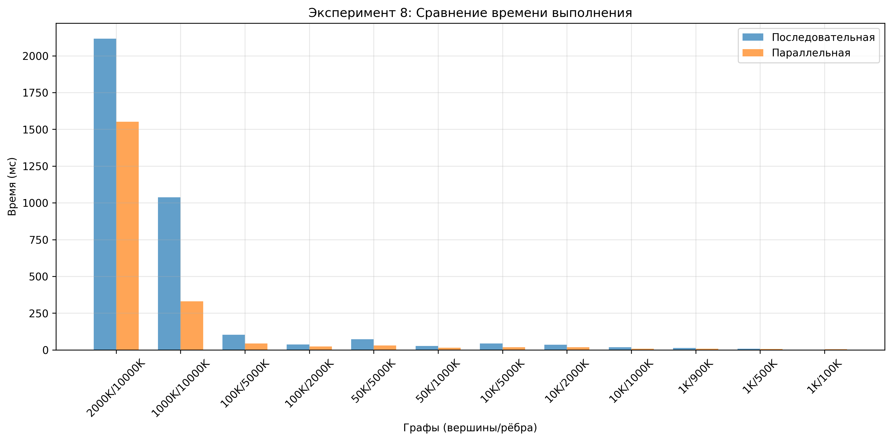

# Эксперименты с параллельным BFS

## Эксперимент 1: Тип очереди

| Вершины | Рёбра    | ConcurrentLinkedQueue (мс) | LinkedBlockingQueue (мс) |
|---------|----------|----------------------------|--------------------------|
| 10      | 10       | 0                          | 0                        |
| 10      | 50       | 1                          | 0                        |
| 10      | 90       | 0                          | 0                        |
| 100     | 5000     | 1                          | 0                        |
| 100     | 9900     | 1                          | 1                        |
| 1000    | 50000    | 14                         | 239                      |
| 1000    | 100000   | 2                          | 173                      |
| 1000    | 500000   | 3                          | 170                      |
| 1000    | 900000   | 7                          | 177                      |
| 10000   | 1000000  | 10                         | 271                      |
| 10000   | 2000000  | 13                         | 245                      |
| 10000   | 5000000  | 19                         | 186                      |
| 50000   | 1000000  | 18                         | 411                      |
| 50000   | 5000000  | 30                         | 279                      |
| 100000  | 2000000  | 30                         | 412                      |
| 100000  | 5000000  | 46                         | 374                      |
| 1000000 | 10000000 | 233                        | 1710                     |
| 2000000 | 10000000 | 1264                       | 2256                     |

## Эксперимент 2: Thread Pool

## Сравнение производительности различных пулов потоков

| Вершины | Рёбра    | FixedThreadPool (мс) | CachedThreadPool (мс) | WorkStealingPool (мс) |
|---------|----------|----------------------|-----------------------|-----------------------|
| 10      | 10       | 0                    | 0                     | 0                     |
| 10      | 50       | 0                    | 0                     | 0                     |
| 10      | 90       | 0                    | 0                     | 0                     |
| 100     | 5000     | 1                    | 1                     | 1                     |
| 100     | 9900     | 1                    | 0                     | 1                     |
| 1000    | 50000    | 12                   | 54                    | 17                    |
| 1000    | 100000   | 2                    | 14                    | 4                     |
| 1000    | 500000   | 3                    | 27                    | 6                     |
| 1000    | 900000   | 7                    | 26                    | 6                     |
| 10000   | 1000000  | 10                   | 40                    | 13                    |
| 10000   | 2000000  | 12                   | 61                    | 16                    |
| 10000   | 5000000  | 19                   | 120                   | 21                    |
| 50000   | 1000000  | 18                   | 109                   | 19                    |
| 50000   | 5000000  | 31                   | 124                   | 28                    |
| 100000  | 2000000  | 26                   | 215                   | 39                    |
| 100000  | 5000000  | 43                   | 214                   | 48                    |
| 1000000 | 10000000 | 738                  | 2686                  | 1132                  |
| 2000000 | 10000000 | 2227                 | 2221                  | 2243                  |

## Эксперимент 3: AtomicIntegerArray vs AtomicBoolean[] vs AtomicBitmap

| Вершины    | Рёбра      | AtomicIntegerArray (мс) | AtomicBoolean[] (мс) | AtomicBitmap (мс) |
|------------|------------|-------------------------|----------------------|-------------------|
| 10         | 10         | 0                       | 0                    | 0                 |
| 10         | 50         | 0                       | 0                    | 0                 |
| 10         | 90         | 0                       | 0                    | 0                 |
| 100        | 5,000      | 0                       | 1                    | 1                 |
| 100        | 9,900      | 1                       | 1                    | 1                 |
| 1,000      | 50,000     | 10                      | 9                    | 10                |
| 1,000      | 100,000    | 2                       | 2                    | 2                 |
| 1,000      | 500,000    | 5                       | 5                    | 5                 |
| 1,000      | 900,000    | 8                       | 10                   | 9                 |
| 10,000     | 1,000,000  | 11                      | 13                   | 12                |
| 10,000     | 2,000,000  | 15                      | 16                   | 27                |
| 10,000     | 5,000,000  | 20                      | 23                   | 28                |
| 50,000     | 1,000,000  | 18                      | 16                   | 21                |
| 50,000     | 5,000,000  | 30                      | 30                   | 32                |
| 100,000    | 2,000,000  | 30                      | 36                   | 29                |
| 100,000    | 5,000,000  | 52                      | 42                   | 69                |
| 1,000,000  | 10,000,000 | 802                     | 1019                 | 755               |
| 2,000,000  | 10,000,000 | 2136                    | 2265                 | 2213              |

## Эксперимент 4: Порог для параллелизации

| Constant | Time (ms) |
|----------|-----------|
| 1        | 247       |
| 2        | 297       |
| 3        | 277       |
| 4        | 245       |
| 6        | 268       |
| 8        | 288       |
| 10       | 243       |
| 12       | 313       |
| 14       | 334       |

| Constant | Time (ms) |
|----------|-----------|
| 1        | 1085      |
| 2        | 970       |
| 3        | 944       |
| 4        | 980       |
| 6        | 943       |
| 8        | 943       |
| 10       | 941       |
| 12       | 945       |
| 14       | 950       |

## Эксперимент 5: CountDownLatch vs CyclicBarrier

| Вершины   | Рёбра      | CountDownLatch (мс) | CyclicBarrier (мс) |
|-----------|------------|---------------------|--------------------|
| 2,000,000 | 10,000,000 | 1682                | 1715               |
| 1,000,000 | 10,000,000 | 230                 | 339                |
| 100,000   | 5,000,000  | 43                  | 50                 |
| 100,000   | 2,000,000  | 24                  | 27                 |
| 50,000    | 5,000,000  | 29                  | 33                 |
| 50,000    | 1,000,000  | 15                  | 16                 |
| 10,000    | 5,000,000  | 18                  | 26                 |
| 10,000    | 2,000,000  | 21                  | 24                 |
| 10,000    | 1,000,000  | 9                   | 8                  |
| 1,000     | 900,000    | 9                   | 7                  |
| 1,000     | 500,000    | 7                   | 5                  |
| 1,000     | 100,000    | 5                   | 3                  |
| 1,000     | 50,000     | 5                   | 4                  |
| 100       | 9,900      | 0                   | 0                  |
| 100       | 5,000      | 0                   | 0                  |
| 10        | 90         | 0                   | 0                  |
| 10        | 50         | 0                   | 0                  |
| 10        | 10         | 0                   | 0                  |

## Эксперимент 6: Тянуть из очереди vs Обрабатывать chunk-ами

| Вершины | Рёбра      | Очередь (мс) | Chunk-и (мс) |
|---------|------------|--------------|--------------|
| 2000000 | 10000000   | 1715         | 2231         |
| 1000000 | 10000000   | 339          | 745          |
| 100000  | 5000000    | 50           | 43           |
| 100000  | 2000000    | 27           | 23           |
| 50000   | 5000000    | 33           | 31           |
| 50000   | 1000000    | 16           | 15           |
| 10000   | 5000000    | 26           | 19           |
| 10000   | 2000000    | 24           | 23           |
| 10000   | 1000000    | 8            | 9            |
| 1000    | 900000     | 7            | 8            |
| 1000    | 500000     | 5            | 6            |
| 1000    | 100000     | 3            | 4            |
| 1000    | 50000      | 4            | 4            |
| 100     | 9900       | 0            | 1            |
| 100     | 5000       | 0            | 0            |
| 10      | 90         | 0            | 0            |
| 10      | 50         | 0            | 0            |
| 10      | 10         | 0            | 0            |

## Эксперимент 7: Количество потоков (ресурсов)

| Threads | Time (ms) | Speedup |
|---------|-----------|---------|
| 1       | 1419      | 1.0x    |
| 2       | 1122      | 1.26x   |
| 4       | 960       | 1.48x   |
| 8       | 1125      | 1.26x   |
| 12      | 1134      | 1.25x   |
| 16      | 1166      | 1.22x   |
| 20      | 1151      | 1.23x   |
| 24      | 1131      | 1.25x   |
| 28      | 1129      | 1.26x   |
| 32      | 1133      | 1.25x   |

## Эксперимент 8: Сравнение последовательной и параллельной реализаций

| Вершины | Рёбра     | Последовательное время (мс) | Параллельное время (мс) |
|---------|-----------|-----------------------------|-------------------------|
| 2000000 | 10000000  | 2116                        | 1551                    |
| 1000000 | 10000000  | 1037                        | 331                     |
| 100000  | 5000000   | 103                         | 43                      |
| 100000  | 2000000   | 37                          | 23                      |
| 50000   | 5000000   | 73                          | 30                      |
| 50000   | 1000000   | 27                          | 15                      |
| 10000   | 5000000   | 43                          | 19                      |
| 10000   | 2000000   | 36                          | 18                      |
| 10000   | 1000000   | 18                          | 9                       |
| 1000    | 900000    | 14                          | 8                       |
| 1000    | 500000    | 8                           | 6                       |
| 1000    | 100000    | 1                           | 4                       |
| 1000    | 50000     | 0                           | 5                       |
| 100     | 9900      | 0                           | 0                       |
| 100     | 5000      | 0                           | 0                       |
| 10      | 90        | 0                           | 0                       |
| 10      | 50        | 0                           | 0                       |
| 10      | 10        | 0                           | 0                       |

